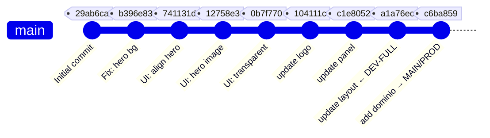

# 🌿 Git — Branches e Histórico

tags: #git #branches #versionamento
related: [[🏠 Início]] · [[Ambientes — Dev e Produção]]

---

## Estratégia de Branches

```
origin/main ──────────────────────────────────────►  (produção — Hostinger)
    │
    └─── dev-full ─────────────────────────────────►  (desenvolvimento completo — localhost)
```

### `main` — Produção

- **URL:** https://icenvsp.com.br
- **Hospedagem:** Hostinger
- **Estado:** Versão **simplificada** — exibe apenas a página de Cultos
- **⚠️ Regra:** **Não alterar** até que a versão completa seja aprovada

### `dev-full` — Desenvolvimento Completo

- **URL:** http://localhost:3000
- **Ambiente:** Docker (container `igreja-crist-evan-web-1`)
- **Estado:** Versão **completa** com todas as views e navegação
- **Base:** Commit `a1a76ec` ("update layout" — 25/Jul/2026)

---

## 📜 Histórico de Commits

| Hash | Mensagem | Data | Branch | Observação |
|---|---|---|---|---|
| `c6ba859` | add dominio | 29/Jul/2026 | main | Simplificou o site para publicação no Hostinger |
| `a1a76ec` | update layout | 25/Jul/2026 | **dev-full** | **Versão completa — ponto de partida do dev** |
| `c1e8052` | update panel | — | dev-full | Admin panel atualizado |
| `104111c` | update logo | 19/Jul/2026 | dev-full | Logos da denominação adicionados |
| `0b7f770` | UI: Make hero banner transparent | — | dev-full | Hero sem caixa de contorno |
| `12758e3` | UI: Change hero background | — | dev-full | Imagem de fundo alterada |
| `741131d` | UI: Align hero card to left | — | dev-full | Alinhamento do card do hero |
| `b396e83` | Fix: Set HomeView hero background | — | dev-full | Correção da imagem inicial |
| `29ab6ca` | Initial commit | — | dev-full | Cópia inicial do projeto local |

---

## O que foi Simplificado no Commit `c6ba859`

O commit de publicação no Hostinger realizou as seguintes reduções:

| Arquivo | Alteração |
|---|---|
| `src/App.tsx` | Switch de roteamento substituído por `CultosView` fixo |
| `src/components/CultosView.tsx` | 512 → ~180 linhas (versão condensada) |
| `src/components/Footer.tsx` | 77 → linhas reduzidas (links removidos) |
| `src/components/TopNavBar.tsx` | Itens de navegação removidos |
| `src/data.ts` | Entradas do dicionário removidas |
| `src/components/ChurchLogo.tsx` | Simplificado |

> [!important]
> O `dist_20260729_191647.zip` arquivado no repositório é o **build exato** que foi enviado ao Hostinger em 29/Jul/2026.

---

## Fluxo de Trabalho



---

## Comandos Git Úteis

```bash
# Ver branch atual
git branch

# Alternar para dev local (completo)
git checkout dev-full

# Alternar para main (produção)
git checkout main

# Ver diferença entre os branches
git diff main dev-full -- src/App.tsx

# Publicar alterações do dev-full como nova versão
# 1. Fazer build
npm run build
# 2. Zipar o dist/
# 3. Enviar via Hostinger File Manager ou MCP
```
